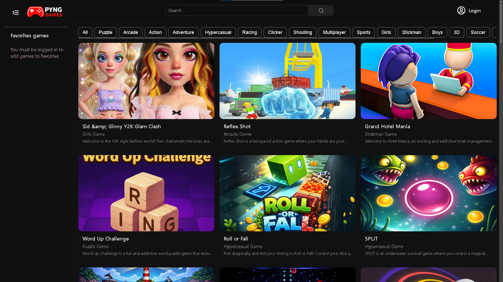
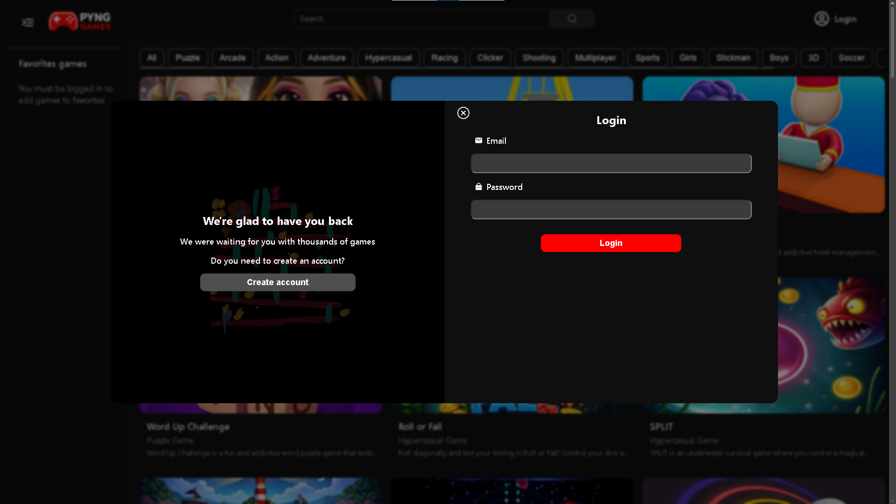
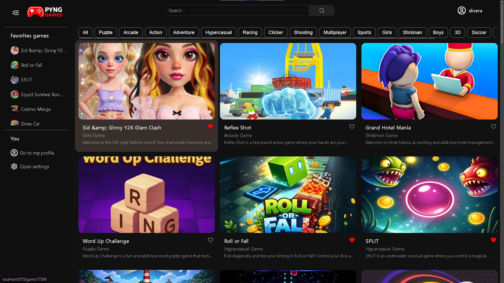
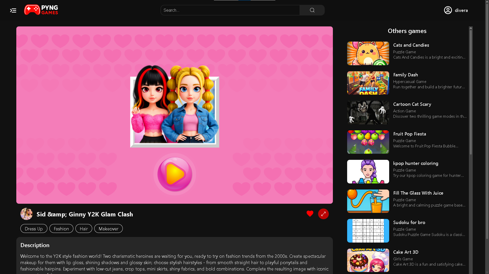
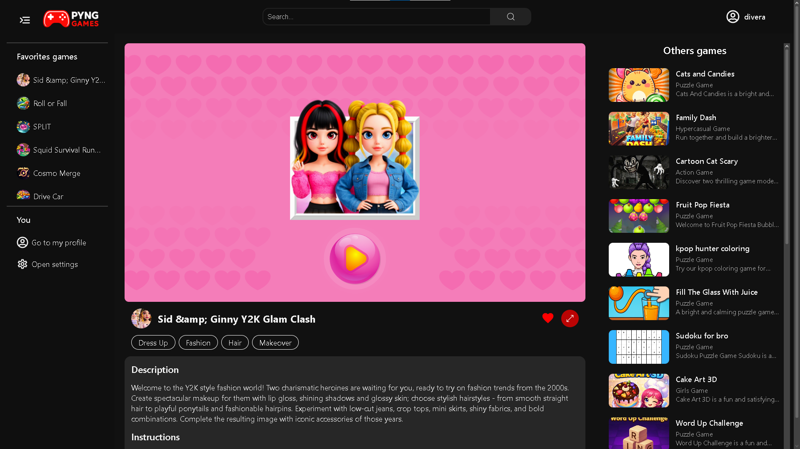
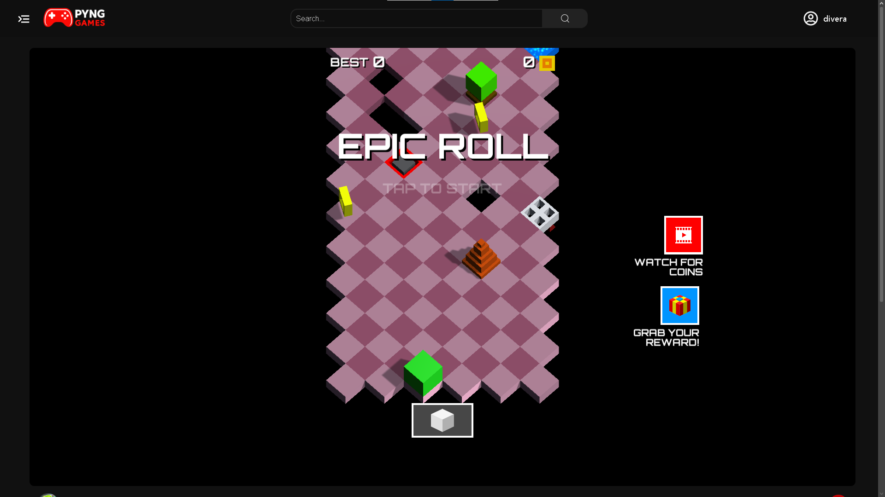
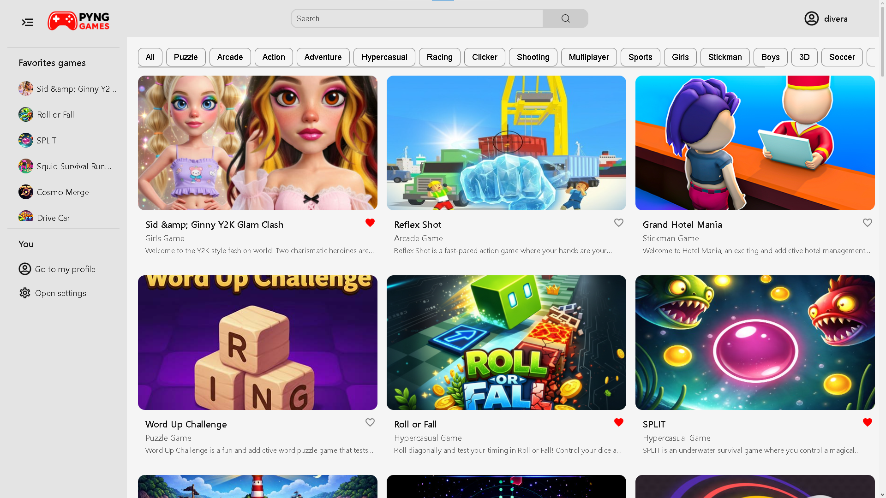
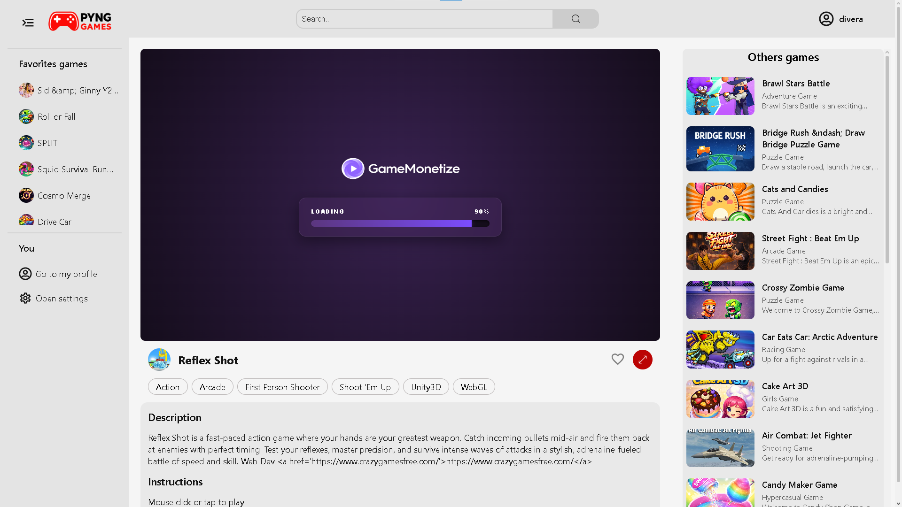

# 🎮 Classic Games Platform - Daniel Vera

Aplicación web de juegos desarrollada con arquitectura fullstack, que permite explorar, jugar y guardar juegos como favoritos. Integra una API externa junto con un sistema de fallback para garantizar disponibilidad y estabilidad.

---

## 🚀 Demo

🔗 https://TU-DEPLOY-AQUI

---

## 🛠️ Tecnologías utilizadas

### Frontend

- ⚛️ React
- ⚡ Vite
- 🎨 CSS / Responsive Design

### Backend

- 🟢 Node.js
- 🚂 Koa
- 🗄️ Sequelize
- 🔐 JWT Authentication

### Testing

- 🧪 Jest
- 🔗 Supertest
- 🎭 Playwright

---

## ✨ Características

- 🎮 Catálogo dinámico de juegos desde API externa
- ❤️ Sistema de favoritos persistente
- 🔐 Autenticación con JWT y rutas protegidas
- ⚡ Manejo de estados de carga (spinners)
- 🚨 Manejo de errores de API sin romper la UI
- 📱 Diseño completamente responsive
- 🌙 Modo oscuro / claro

---

## ⚠️ Consideraciones técnicas

La aplicación originalmente consumía datos desde la API de Gamemonetize. Sin embargo, debido a limitaciones de rate limiting y respuestas inconsistentes, se optó por mockear un conjunto de aproximadamente 200 juegos para garantizar estabilidad en la experiencia.

Actualmente, la aplicación funciona completamente sobre este dataset mockeado, lo que permite:

- ✔ Evitar bloqueos por límite de requests
- ✔ Mantener una experiencia de usuario consistente
- ✔ Reducir tiempos de carga y errores externos

Se evaluó el uso de un sistema híbrido (API + fallback), pero este enfoque introduce casos borde, por ejemplo:

- 🔄 Desincronización al recargar una página de juego
- ❌ IDs de juegos presentes en el mock pero no en la API (o viceversa)
- ⚠️ Posibles errores de navegación que pueden percibirse como fallos de la aplicación

Dado que estos problemas afectan la confiabilidad de mi trabajo, se priorizó una solución estable basada en datos mockeados.

En un entorno productivo real, se recomienda:

- caching en backend
- normalización de datos
- persistencia en base de datos
- evitar dependencia directa de APIs no confiables

---

## 🧩 Funcionalidades destacadas

- 🔎 Navegación y renderizado dinámico de juegos
- 🕹️ Integración con iframes para jugar directamente
- ❤️ Gestión de favoritos por usuario autenticado
- 🛑 Manejo de estados vacíos (empty states UX)
- 🔄 Control de errores y resiliencia ante fallos de API

---

## ⚙️ Instalación

1. Clonar el repositorio:

```bash
git clone https://github.com/tuusuario/tu-repo.git
```

2. Instalar dependencias:

```bash
npm install
```

3. Ejecutar el proyecto:

```bash
npm run dev
```

## 🖼️ Imágenes

### 🖥️ Computador

















### 📱 Móbil

La página es completamente responsiva; se muestra solo una imagen por dispositivo como ejemplo para mantener el README conciso.


